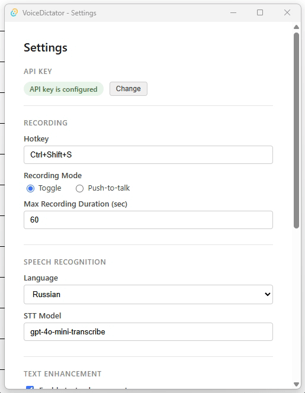

# Voice Dictator

[](CHANGELOG.md#012)
[](LICENSE)
[](https://tauri.app)
[](https://tauri.app)
[](https://www.rust-lang.org)

Tray-first десктопное приложение для голосовой диктовки.

Нажал хоткей - говоришь - нажал снова - текст вставляется в активное поле (IDE, браузер, мессенджер).
Транскрипция через OpenAI API, опциональное улучшение текста через LLM.
Работает из системного трея, без лишних окон.

## Settings



## Возможности

- Два режима записи: Toggle (нажал-говоришь-нажал) и Push-to-Talk (удержание)
- Онлайн STT через OpenAI API - модель настраивается
- Улучшение текста через LLM: пунктуация, грамматика (отключается)
- Автоматическая вставка через clipboard с восстановлением предыдущего содержимого
- VAD auto-stop: запись останавливается при тишине
- Настройки через UI: хоткей, язык, модели STT и LLM, параметры записи
- Онбординг при первом запуске
- Уведомления ОС при смене состояния

## Стек

- **Tauri v2 + Rust** - бэкенд, системная интеграция
- **Svelte / SvelteKit** - UI настроек
- **OpenAI API** - STT (Whisper) + улучшение текста (Responses API)
- **cpal** - захват аудио (WASAPI / CoreAudio / ALSA)
- **enigo + arboard** - симуляция вставки, clipboard

## Требования

- Windows 10+ (проверено), macOS / Linux X11 (в процессе)
- API-ключ OpenAI
- [Rust toolchain](https://rustup.rs/)
- Node.js 18+

## Запуск для разработки

```bash
npm install
npm run tauri dev
```

При первом запуске приложение откроет окно Settings - введи API-ключ OpenAI.

## Windows-скрипты

В корне проекта есть `.bat`-скрипты для частых задач:

- `dev.bat` - запуск приложения в режиме разработки через `npm run tauri dev`
- `build.bat` - сборка portable exe в `dist/`
- `test.bat` - запуск Rust unit-тестов в `src-tauri/`
- `fmt.bat` - форматирование Rust-кода через `cargo fmt`
- `check-all.bat` - полная проверка перед коммитом: `cargo check`, `cargo clippy`, `cargo test`, `cargo fmt --check`

Для этих скриптов на Windows нужен установленный **Build Tools for Visual Studio 2022** с workload **Desktop development with C++**. Скачать именно версию 2022 можно по прямой ссылке Microsoft: [vs_buildtools.exe](https://aka.ms/vs/17/release/vs_buildtools.exe). Эта ссылка также указана в [Visual Studio 2022 Release History](https://learn.microsoft.com/en-us/visualstudio/releases/2022/release-history) в таблице **Evergreen bootstrappers** -> **Current 17.14** -> **Build Tools**.

Скрипты ожидают стандартный путь к окружению MSVC:

```text
C:\Program Files (x86)\Microsoft Visual Studio\2022\BuildTools\VC\Auxiliary\Build\vcvars64.bat
```

`vcvars64.bat` подготавливает переменные окружения для компилятора и linker'а MSVC. Это нужно Rust/Tauri на Windows для сборки нативного приложения и зависимостей.

## Сборка

```bash
npm run build        # только фронтенд
cargo tauri build    # полный бандл (в src-tauri/)
```

## Лицензия

MIT
